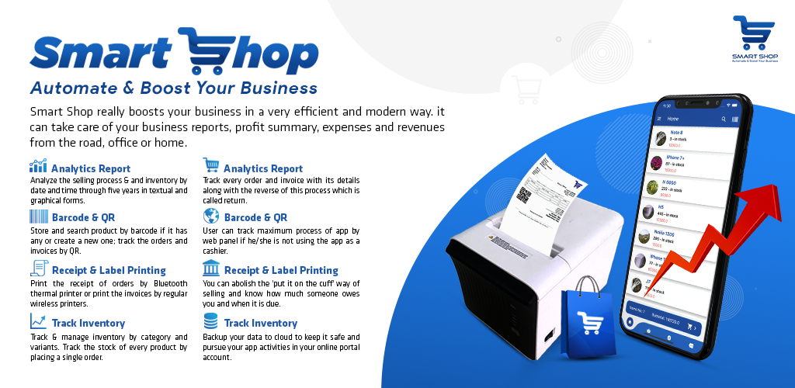

# Smart Shop - Mobile Application

## Overview

**Smart Shop** is a robust Point of Sale (POS) solution designed for small and medium-sized businesses. This mobile application, part of a broader Smart Shop ecosystem, empowers business owners to manage transactions, track inventory, and generate insightful analytics directly from their smartphones or tablets, whether they are on Android or iOS.

Built with **Flutter**, Smart Shop’s mobile app offers a seamless and responsive experience, ensuring that business operations are not confined to a desk. Whether you're managing a retail store, a restaurant, or any other business, this app provides the flexibility to handle your operations on the go.
For the complete Smart Shop experience, including the web-based backend, visit the following link:

- [Smart Shop Website/Backend](https://github.com/arifhaidari/pos_management)



## Key Features

### 1. Orders and Invoicing

- **Order Management**: Easily create, track, and manage customer orders, including the handling of returns directly from your mobile device.
- **Invoice Generation**: Generate, view, and share invoices with detailed transaction information.

### 2. Manage Your Business Anywhere

- **Real-Time Sync**: Sync data in real-time with the cloud, ensuring that all changes are reflected across devices.
- **Multi-User Support**: Allow multiple users with different roles (e.g., cashier, manager) to access the app securely.

### 3. Financial Control in Your Pocket

- **Customer Credit Management**: Keep accurate records of customer credit and payments, eliminating the need for traditional credit books.
- **Expense Tracking**: Log and monitor expenses to maintain control over your business finances from anywhere.

### 4. Cloud Backup and Security

- **Automatic Cloud Backup**: Securely back up your business data to the cloud, preventing data loss even if your device is lost or damaged.
- **Data Encryption**: Protect your sensitive data with industry-standard encryption.

### 5. Advanced Analytics

- **Sales Reports**: Access sales data, profit margins, and revenue reports on the go, with customizable time frames.
- **Inventory Analytics**: Monitor your inventory's performance with detailed reports and notifications about low stock.

### 6. Barcode and QR Code Scanning

- **Easy Product Management**: Scan barcodes or QR codes to quickly add or locate products in your inventory.
- **Streamlined Order Processing**: Use barcode/QR code scanning to efficiently track and complete orders.

### 7. Receipt and Label Printing

- **Thermal and Wireless Printing**: Connect to Bluetooth or wireless printers to print receipts and labels directly from the app.

### 8. Inventory Management

- **Real-Time Stock Monitoring**: Keep track of your inventory levels with real-time updates and alerts for low stock.

## Additional Resources

### 1. Brochure


### 2. Promotional Video

[Watch the Promotional Video](https://www.youtube.com/watch?v=CGohh8mu5r8)

### 3. Tutorial Playlist

A comprehensive playlist of tutorials and user manuals is available to help you get the most out of Smart Shop.
[Watch the Tutorial Playlist](https://www.youtube.com/watch?v=OcSPNzoeV48&list=PLzZJPW96W8VN9rCsCsJ0Urm8uKwSTuHll)

## Technical Stack

- **Framework**: Flutter (Dart)
- **Platforms**: Android & iOS
- **Backend Integration**: Connected with Django backend for synchronized operations.
- **Technologies**: Python (Django), Flutter, Computer Vision
- **Database**: SQLite (local storage with cloud sync)
- **Hardware Integration**: Thermal Printer and Bluetooth

---

## Installation Guide

1. **Clone the Repository**:
   ```bash
   git clone <repository-url>
   cd smart-shop-mobile
   ```
2. **Install Flutter Dependencies**:
   ```bash
   flutter pub get
   ```
3. **Run the Application**:
   - For Android:
     ```bash
     flutter run
     ```
   - For iOS:
     ```bash
     flutter run
     ```

## Usage

- **Dashboard**: Access a personalized dashboard that provides an overview of sales, orders, and inventory.
- **Order Management**: Use the app to create and track orders, issue invoices, and manage returns.
- **Analytics**: Generate and review financial, sales, and inventory reports directly from the app.

## Contributing

We welcome contributions to the Smart Shop mobile application. To contribute:

1. Fork the repository.
2. Create a new branch (`git checkout -b feature-branch`).
3. Implement your feature or fix.
4. Commit your changes (`git commit -m 'Add new feature'`).
5. Push to your branch (`git push origin feature-branch`).
6. Open a pull request.

## License

**Copyright © 2021 Arif Haidari and FSH.**

This mobile application is part of a private project and has been made public for educational purposes only. Commercial use, modification, or distribution without permission is strictly prohibited.

---

## Contact

For inquiries or support:

- **Email:** arifhaidari336@gmail.com

---

**Smart Shop** - Manage Your Business on the Go!
